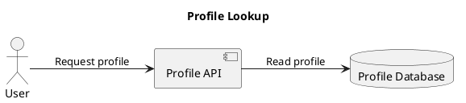

# PlantUML renderer

## Status

PlantUML generation is implemented. A valid JSON document is loaded into the
portable diagram model and rendered as PlantUML source on standard output:

```text
UTF-8 JSON -> validation -> Diagram -> PlantUML renderer -> stdout
```

The renderer produces text only. Converting `.puml` source into SVG, PNG, or
other image formats remains the responsibility of PlantUML or another
compatible tool.

## CLI usage

Print PlantUML to the terminal:

```bash
diagrams-cli examples/04-database-flow.json --format plantuml
```

PlantUML is the default format, so this is equivalent:

```bash
diagrams-cli examples/04-database-flow.json
```

Write the generated source with the native output option:

```bash
diagrams-cli examples/04-database-flow.json -o database-flow.puml
```

Existing files are preserved unless `--force` is supplied. See
[Output files and overwrite protection](output-files.md) for extension rules,
filesystem errors, and the complete overwrite contract.

## Python API

```python
from diagrams_cli.loader import load_diagram
from diagrams_cli.renderers import render_plantuml

diagram = load_diagram("examples/04-database-flow.json")
plantuml_source = render_plantuml(diagram)
```

`render_plantuml` follows the shared `Renderer` callable interface:

```python
Renderer = Callable[[Diagram], str]
```

## Node mapping

Portable node types map to PlantUML elements as follows:

| Portable type | PlantUML keyword |
| --- | --- |
| `actor` | `actor` |
| `service` | `component` |
| `database` | `database` |
| `queue` | `queue` |
| `generic` | `rectangle` |

Every node is declared with its display label and a generated alias:

```plantuml
actor "User" as node_1
component "Profile API" as node_2
database "Profile Database" as node_3
```

Input node IDs are used to resolve relationships but are never copied into
PlantUML aliases. Sequential aliases such as `node_1` make arbitrary JSON IDs
safe and keep output deterministic.

## Titles and direction

- A diagram title produces a one-line `title` command.
- `left-to-right` produces `left to right direction`.
- `top-to-bottom` uses PlantUML's default direction and emits no extra command.

## Edges

Every edge becomes a directed dependency arrow:

```plantuml
node_1 --> node_2
node_2 --> node_3 : Read profile
```

An absent or empty label omits the colon and label text.

## Text safety

User titles, node labels, and edge labels are kept on one PlantUML source line.
The renderer escapes:

- Percent signs as `%percent()`
- Dollar signs as `%dollar()`
- Backslashes as `%backslash()`
- Line endings as `%n()`
- Tabs as `%tab()`
- Double quotes as escaped quotes inside quoted node labels

These rules prevent user-controlled text and node IDs from introducing new
PlantUML source statements. The percentage, dollar, backslash, and newline
forms follow PlantUML's documented preprocessor escape functions.

## Determinism

Output is byte-stable for the same validated model:

- Nodes and edges retain JSON input order.
- Aliases are assigned sequentially from node order.
- No timestamps, random values, or environment data are emitted.
- Output always ends with one newline.

Each JSON sample has a checked-in golden result under `examples/plantuml/`.
Tests compare every generated result byte-for-byte with its golden file.

## Example output

For `examples/04-database-flow.json`:



See [Sample diagrams](samples.md) for all ten inputs and golden outputs.

## Verification

The test suite covers:

- The common renderer interface
- Every portable node-type mapping
- Titles, both directions, labeled and unlabeled edges
- Escaping and isolation of unsafe source IDs
- Determinism
- CLI stdout behavior
- Byte-for-byte golden output for all ten samples

When a local PlantUML command is available, syntax can be checked with:

```bash
plantuml -checkonly examples/plantuml/*.puml
```

## Remaining limitations

- Excalidraw generation remains an explicit placeholder.
- The CLI accepts only file input; stdin support is planned.
- Explicit `-` stdin/stdout paths are not implemented yet.
- The renderer emits PlantUML source but does not invoke PlantUML to create an
  image.

## PlantUML references

- [Component diagram syntax](https://plantuml.com/component-diagram)
- [Deployment elements, including queue](https://plantuml.com/deployment-diagram)
- [Preprocessor escape functions](https://plantuml.com/preprocessing)
- [Newline and backslash migration](https://plantuml.com/newline)
