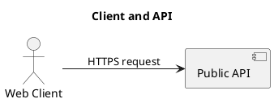

# Sample diagrams

The `examples/` directory contains ten valid diagram descriptions. They grow
from an empty document to a platform with multiple actors, services, queues,
databases, branches, joins, and feedback paths.

## Current renderer status

Both CLI format paths were executed for every sample. PlantUML now produces
real source on stdout, and every result is checked in under
`examples/plantuml/` as a golden file. Excalidraw still returns its explicit
placeholder.

## Complexity progression

| # | Sample | Nodes | Edges | PlantUML result | New concepts |
| --- | --- | ---: | ---: | --- | --- |
| 1 | [`01-empty-diagram.json`](../examples/01-empty-diagram.json) | 0 | 0 | [`01-empty-diagram.puml`](../examples/plantuml/01-empty-diagram.puml) | Smallest valid document and defaults |
| 2 | [`02-single-node.json`](../examples/02-single-node.json) | 1 | 0 | [`02-single-node.puml`](../examples/plantuml/02-single-node.puml) | Title and default `generic` node type |
| 3 | [`03-basic-relationship.json`](../examples/03-basic-relationship.json) | 2 | 1 | [`03-basic-relationship.puml`](../examples/plantuml/03-basic-relationship.puml) | Actor, service, direction, and labeled edge |
| 4 | [`04-database-flow.json`](../examples/04-database-flow.json) | 3 | 2 | [`04-database-flow.puml`](../examples/plantuml/04-database-flow.puml) | Three-stage request and database flow |
| 5 | [`05-queued-workflow.json`](../examples/05-queued-workflow.json) | 4 | 3 | [`05-queued-workflow.puml`](../examples/plantuml/05-queued-workflow.puml) | Queue and asynchronous worker |
| 6 | [`06-service-fan-out.json`](../examples/06-service-fan-out.json) | 5 | 5 | [`06-service-fan-out.puml`](../examples/plantuml/06-service-fan-out.puml) | Fan-out, merge, and all-purpose generic node |
| 7 | [`07-event-driven-ordering.json`](../examples/07-event-driven-ordering.json) | 6 | 6 | [`07-event-driven-ordering.puml`](../examples/plantuml/07-event-driven-ordering.puml) | Event-driven persistence and fulfillment |
| 8 | [`08-microservices-system.json`](../examples/08-microservices-system.json) | 9 | 10 | [`08-microservices-system.puml`](../examples/plantuml/08-microservices-system.puml) | Gateway fan-out and database-per-service |
| 9 | [`09-resilient-observability-loop.json`](../examples/09-resilient-observability-loop.json) | 11 | 15 | [`09-resilient-observability-loop.puml`](../examples/plantuml/09-resilient-observability-loop.puml) | Retry cycle, dead letters, metrics, alerts, and replay |
| 10 | [`10-commerce-platform.json`](../examples/10-commerce-platform.json) | 15 | 22 | [`10-commerce-platform.puml`](../examples/plantuml/10-commerce-platform.puml) | Multi-actor commerce platform with synchronous and event-driven paths |

The regression test `tests/test_examples.py` verifies that exactly ten samples
exist, every sample validates, and each successive sample has a larger
`(node count, edge count)` pair.

## Running a sample

With the package installed:

```bash
diagrams-cli examples/04-database-flow.json --format plantuml
diagrams-cli examples/04-database-flow.json --format excalidraw
```

From a source checkout:

```bash
PYTHONPATH=src python -m diagrams_cli examples/04-database-flow.json --format plantuml
PYTHONPATH=src python -m diagrams_cli examples/04-database-flow.json --format excalidraw
```

Write the PlantUML result safely to a file:

```bash
diagrams-cli examples/04-database-flow.json -o database-flow.puml
```

## Results by output format

| Sample | PlantUML path | Excalidraw path |
| --- | --- | --- |
| 01 — Empty diagram | Exit `0`; generated golden source | Exit `0`; placeholder returned |
| 02 — Single node | Exit `0`; generated golden source | Exit `0`; placeholder returned |
| 03 — Basic relationship | Exit `0`; generated golden source | Exit `0`; placeholder returned |
| 04 — Database flow | Exit `0`; generated golden source | Exit `0`; placeholder returned |
| 05 — Queued workflow | Exit `0`; generated golden source | Exit `0`; placeholder returned |
| 06 — Service fan-out | Exit `0`; generated golden source | Exit `0`; placeholder returned |
| 07 — Event-driven ordering | Exit `0`; generated golden source | Exit `0`; placeholder returned |
| 08 — Microservices system | Exit `0`; generated golden source | Exit `0`; placeholder returned |
| 09 — Resilient observability loop | Exit `0`; generated golden source | Exit `0`; placeholder returned |
| 10 — Commerce platform | Exit `0`; generated golden source | Exit `0`; placeholder returned |

## Recorded CLI output

The PlantUML run for `03-basic-relationship.json` now returns:



The Excalidraw run for the same input still returns:

```text
Placeholder: would generate excalidraw from examples/03-basic-relationship.json
```

## Renderer fixture use

The sample inputs now serve as renderer fixtures:

- PlantUML runs are compared with byte-stable checked-in `.puml` text.
- All ten PlantUML golden files pass `plantuml -checkonly` syntax validation.
- Excalidraw runs should produce byte-stable `.excalidraw` JSON with stable
  element IDs and layout after that renderer is implemented.
