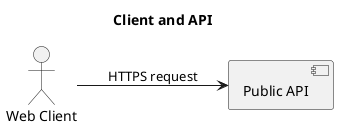

# Sample diagrams

The `examples/` directory contains thirty valid diagram descriptions. The
original ten grow from an empty document to a commerce platform. Twenty
additional focused scenarios exercise self-loops, disconnected nodes, cycles,
joins, feedback paths, and different architecture domains without requiring
every example to be larger than the previous one.

## Current renderer status

Both CLI format paths were executed for every sample. Every PlantUML result is
checked in under `examples/plantuml/`, and every editable Excalidraw result is
checked in under `examples/excalidraw/`.

## Complexity progression

The original ten remain the progressive baseline:

| # | Sample | Nodes | Edges | PlantUML | Excalidraw | New concepts |
| --- | --- | ---: | ---: | --- | --- | --- |
| 1 | [`01-empty-diagram.json`](../examples/01-empty-diagram.json) | 0 | 0 | [`puml`](../examples/plantuml/01-empty-diagram.puml) | [`excalidraw`](../examples/excalidraw/01-empty-diagram.excalidraw) | Smallest valid document and defaults |
| 2 | [`02-single-node.json`](../examples/02-single-node.json) | 1 | 0 | [`puml`](../examples/plantuml/02-single-node.puml) | [`excalidraw`](../examples/excalidraw/02-single-node.excalidraw) | Title and default `generic` node type |
| 3 | [`03-basic-relationship.json`](../examples/03-basic-relationship.json) | 2 | 1 | [`puml`](../examples/plantuml/03-basic-relationship.puml) | [`excalidraw`](../examples/excalidraw/03-basic-relationship.excalidraw) | Actor, service, direction, and labeled edge |
| 4 | [`04-database-flow.json`](../examples/04-database-flow.json) | 3 | 2 | [`puml`](../examples/plantuml/04-database-flow.puml) | [`excalidraw`](../examples/excalidraw/04-database-flow.excalidraw) | Three-stage request and database flow |
| 5 | [`05-queued-workflow.json`](../examples/05-queued-workflow.json) | 4 | 3 | [`puml`](../examples/plantuml/05-queued-workflow.puml) | [`excalidraw`](../examples/excalidraw/05-queued-workflow.excalidraw) | Queue and asynchronous worker |
| 6 | [`06-service-fan-out.json`](../examples/06-service-fan-out.json) | 5 | 5 | [`puml`](../examples/plantuml/06-service-fan-out.puml) | [`excalidraw`](../examples/excalidraw/06-service-fan-out.excalidraw) | Fan-out, merge, and all-purpose generic node |
| 7 | [`07-event-driven-ordering.json`](../examples/07-event-driven-ordering.json) | 6 | 6 | [`puml`](../examples/plantuml/07-event-driven-ordering.puml) | [`excalidraw`](../examples/excalidraw/07-event-driven-ordering.excalidraw) | Event-driven persistence and fulfillment |
| 8 | [`08-microservices-system.json`](../examples/08-microservices-system.json) | 9 | 10 | [`puml`](../examples/plantuml/08-microservices-system.puml) | [`excalidraw`](../examples/excalidraw/08-microservices-system.excalidraw) | Gateway fan-out and database-per-service |
| 9 | [`09-resilient-observability-loop.json`](../examples/09-resilient-observability-loop.json) | 11 | 15 | [`puml`](../examples/plantuml/09-resilient-observability-loop.puml) | [`excalidraw`](../examples/excalidraw/09-resilient-observability-loop.excalidraw) | Retry cycle, dead letters, metrics, alerts, and replay |
| 10 | [`10-commerce-platform.json`](../examples/10-commerce-platform.json) | 15 | 22 | [`puml`](../examples/plantuml/10-commerce-platform.puml) | [`excalidraw`](../examples/excalidraw/10-commerce-platform.excalidraw) | Multi-actor commerce platform with synchronous and event-driven paths |

## Focused scenarios

| # | Sample | Nodes | Edges | PlantUML | Excalidraw | Focus |
| --- | --- | ---: | ---: | --- | --- | --- |
| 11 | [`11-self-monitoring-service.json`](../examples/11-self-monitoring-service.json) | 1 | 1 | [`puml`](../examples/plantuml/11-self-monitoring-service.puml) | [`excalidraw`](../examples/excalidraw/11-self-monitoring-service.excalidraw) | Visible self-edge geometry |
| 12 | [`12-disconnected-capabilities.json`](../examples/12-disconnected-capabilities.json) | 4 | 0 | [`puml`](../examples/plantuml/12-disconnected-capabilities.puml) | [`excalidraw`](../examples/excalidraw/12-disconnected-capabilities.excalidraw) | Disconnected nodes and every main shape family |
| 13 | [`13-bidirectional-replication.json`](../examples/13-bidirectional-replication.json) | 2 | 2 | [`puml`](../examples/plantuml/13-bidirectional-replication.puml) | [`excalidraw`](../examples/excalidraw/13-bidirectional-replication.excalidraw) | Two-node cycle |
| 14 | [`14-three-service-cycle.json`](../examples/14-three-service-cycle.json) | 3 | 3 | [`puml`](../examples/plantuml/14-three-service-cycle.puml) | [`excalidraw`](../examples/excalidraw/14-three-service-cycle.excalidraw) | Three-node strongly connected component |
| 15 | [`15-diamond-processing.json`](../examples/15-diamond-processing.json) | 5 | 5 | [`puml`](../examples/plantuml/15-diamond-processing.puml) | [`excalidraw`](../examples/excalidraw/15-diamond-processing.excalidraw) | Branch and join diamond |
| 16 | [`16-document-approval.json`](../examples/16-document-approval.json) | 6 | 7 | [`puml`](../examples/plantuml/16-document-approval.puml) | [`excalidraw`](../examples/excalidraw/16-document-approval.excalidraw) | Human approval and revision feedback |
| 17 | [`17-publish-subscribe.json`](../examples/17-publish-subscribe.json) | 7 | 7 | [`puml`](../examples/plantuml/17-publish-subscribe.puml) | [`excalidraw`](../examples/excalidraw/17-publish-subscribe.excalidraw) | Topic fan-out to independent consumers |
| 18 | [`18-etl-pipeline.json`](../examples/18-etl-pipeline.json) | 8 | 8 | [`puml`](../examples/plantuml/18-etl-pipeline.puml) | [`excalidraw`](../examples/excalidraw/18-etl-pipeline.excalidraw) | Multi-source ETL and catalog join |
| 19 | [`19-cicd-deployment.json`](../examples/19-cicd-deployment.json) | 9 | 10 | [`puml`](../examples/plantuml/19-cicd-deployment.puml) | [`excalidraw`](../examples/excalidraw/19-cicd-deployment.excalidraw) | Delivery pipeline with rollback feedback |
| 20 | [`20-iot-telemetry.json`](../examples/20-iot-telemetry.json) | 9 | 10 | [`puml`](../examples/plantuml/20-iot-telemetry.puml) | [`excalidraw`](../examples/excalidraw/20-iot-telemetry.excalidraw) | Streaming telemetry, alerting, and control |
| 21 | [`21-authentication-flow.json`](../examples/21-authentication-flow.json) | 8 | 10 | [`puml`](../examples/plantuml/21-authentication-flow.puml) | [`excalidraw`](../examples/excalidraw/21-authentication-flow.excalidraw) | Federated login and session feedback |
| 22 | [`22-cache-aside.json`](../examples/22-cache-aside.json) | 6 | 8 | [`puml`](../examples/plantuml/22-cache-aside.puml) | [`excalidraw`](../examples/excalidraw/22-cache-aside.excalidraw) | Cache hits, misses, and invalidation |
| 23 | [`23-saga-orchestration.json`](../examples/23-saga-orchestration.json) | 10 | 13 | [`puml`](../examples/plantuml/23-saga-orchestration.puml) | [`excalidraw`](../examples/excalidraw/23-saga-orchestration.excalidraw) | Saga orchestration and compensation |
| 24 | [`24-cqrs-read-model.json`](../examples/24-cqrs-read-model.json) | 9 | 9 | [`puml`](../examples/plantuml/24-cqrs-read-model.puml) | [`excalidraw`](../examples/excalidraw/24-cqrs-read-model.excalidraw) | CQRS write and projection paths |
| 25 | [`25-data-lake-governance.json`](../examples/25-data-lake-governance.json) | 10 | 12 | [`puml`](../examples/plantuml/25-data-lake-governance.puml) | [`excalidraw`](../examples/excalidraw/25-data-lake-governance.excalidraw) | Data quality, catalog, and governance |
| 26 | [`26-multi-region-failover.json`](../examples/26-multi-region-failover.json) | 10 | 13 | [`puml`](../examples/plantuml/26-multi-region-failover.puml) | [`excalidraw`](../examples/excalidraw/26-multi-region-failover.excalidraw) | Regional routing, health, and replication cycle |
| 27 | [`27-ml-inference-platform.json`](../examples/27-ml-inference-platform.json) | 10 | 13 | [`puml`](../examples/plantuml/27-ml-inference-platform.puml) | [`excalidraw`](../examples/excalidraw/27-ml-inference-platform.excalidraw) | Features, models, GPU jobs, and drift feedback |
| 28 | [`28-observability-pipeline.json`](../examples/28-observability-pipeline.json) | 11 | 13 | [`puml`](../examples/plantuml/28-observability-pipeline.puml) | [`excalidraw`](../examples/excalidraw/28-observability-pipeline.excalidraw) | Logs, traces, metrics, and incident correlation |
| 29 | [`29-zero-trust-access.json`](../examples/29-zero-trust-access.json) | 11 | 14 | [`puml`](../examples/plantuml/29-zero-trust-access.puml) | [`excalidraw`](../examples/excalidraw/29-zero-trust-access.excalidraw) | Device, identity, policy, audit, and SOC feedback |
| 30 | [`30-smart-city-platform.json`](../examples/30-smart-city-platform.json) | 12 | 15 | [`puml`](../examples/plantuml/30-smart-city-platform.puml) | [`excalidraw`](../examples/excalidraw/30-smart-city-platform.excalidraw) | Three-domain city operations fan-out |

The regression test `tests/test_examples.py` verifies that exactly thirty
distinct, sequentially named samples exist and all validate. It separately
preserves the increasing `(node count, edge count)` assertion for the original
ten-sample progression.

## Running a sample

With the package installed:

```bash
diagrams-cli examples/04-database-flow.json --format plantuml
diagrams-cli examples/04-database-flow.json --format excalidraw
```

From a source checkout:

```bash
PYTHONPATH=src python -m diagrams_cli examples/04-database-flow.json --format plantuml
PYTHONPATH=src python -m diagrams_cli examples/04-database-flow.json --format excalidraw
```

Write the PlantUML result safely to a file:

```bash
diagrams-cli examples/04-database-flow.json -o database-flow.puml
```

Write the Excalidraw result safely to a file:

```bash
diagrams-cli examples/04-database-flow.json \
  --format excalidraw \
  -o database-flow.excalidraw
```

## Results by output format

| Sample | PlantUML path | Excalidraw path |
| --- | --- | --- |
| 01 — Empty diagram | Exit `0`; golden source | Exit `0`; golden JSON |
| 02 — Single node | Exit `0`; golden source | Exit `0`; golden JSON |
| 03 — Basic relationship | Exit `0`; golden source | Exit `0`; golden JSON |
| 04 — Database flow | Exit `0`; golden source | Exit `0`; golden JSON |
| 05 — Queued workflow | Exit `0`; golden source | Exit `0`; golden JSON |
| 06 — Service fan-out | Exit `0`; golden source | Exit `0`; golden JSON |
| 07 — Event-driven ordering | Exit `0`; golden source | Exit `0`; golden JSON |
| 08 — Microservices system | Exit `0`; golden source | Exit `0`; golden JSON |
| 09 — Resilient observability loop | Exit `0`; golden source | Exit `0`; golden JSON |
| 10 — Commerce platform | Exit `0`; golden source | Exit `0`; golden JSON |
| 11 — Self-monitoring service | Exit `0`; golden source | Exit `0`; golden JSON |
| 12 — Disconnected capabilities | Exit `0`; golden source | Exit `0`; golden JSON |
| 13 — Bidirectional replication | Exit `0`; golden source | Exit `0`; golden JSON |
| 14 — Three-service cycle | Exit `0`; golden source | Exit `0`; golden JSON |
| 15 — Diamond processing | Exit `0`; golden source | Exit `0`; golden JSON |
| 16 — Document approval | Exit `0`; golden source | Exit `0`; golden JSON |
| 17 — Publish-subscribe | Exit `0`; golden source | Exit `0`; golden JSON |
| 18 — ETL pipeline | Exit `0`; golden source | Exit `0`; golden JSON |
| 19 — CI/CD deployment | Exit `0`; golden source | Exit `0`; golden JSON |
| 20 — IoT telemetry | Exit `0`; golden source | Exit `0`; golden JSON |
| 21 — Authentication flow | Exit `0`; golden source | Exit `0`; golden JSON |
| 22 — Cache-aside | Exit `0`; golden source | Exit `0`; golden JSON |
| 23 — Saga orchestration | Exit `0`; golden source | Exit `0`; golden JSON |
| 24 — CQRS read model | Exit `0`; golden source | Exit `0`; golden JSON |
| 25 — Data lake governance | Exit `0`; golden source | Exit `0`; golden JSON |
| 26 — Multi-region failover | Exit `0`; golden source | Exit `0`; golden JSON |
| 27 — ML inference platform | Exit `0`; golden source | Exit `0`; golden JSON |
| 28 — Observability pipeline | Exit `0`; golden source | Exit `0`; golden JSON |
| 29 — Zero-trust access | Exit `0`; golden source | Exit `0`; golden JSON |
| 30 — Smart city platform | Exit `0`; golden source | Exit `0`; golden JSON |

## Recorded CLI output

The PlantUML run for `03-basic-relationship.json` now returns:



The Excalidraw run for the same input returns a version 2 Excalidraw document
containing a title, one bound arrow, two shapes, three text labels, and stable
metadata. Its complete result is checked in at
[`03-basic-relationship.excalidraw`](../examples/excalidraw/03-basic-relationship.excalidraw).

## Renderer fixture use

The sample inputs now serve as renderer fixtures:

- PlantUML runs are compared with byte-stable checked-in `.puml` text.
- All thirty PlantUML golden files pass `plantuml -checkonly` syntax validation.
- Excalidraw runs are compared with byte-stable `.excalidraw` JSON and
  structurally checked for metadata, element arrays, and non-overlapping node
  placements.
- Installed subprocess tests compare all thirty PlantUML results through
  `diagrams-cli` and all thirty Excalidraw results through
  `python -m diagrams_cli`.

See [Testing and golden fixtures](testing.md) for the fixture contract,
installed-wheel isolation, coverage matrix, and regeneration workflow.
